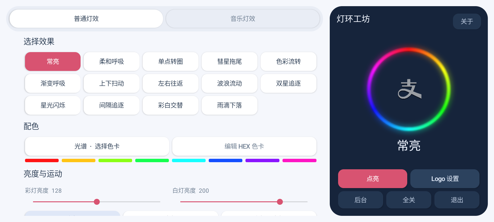

# N5D 灯环工坊

**支付宝 N5 系列碰一碰设备专用的灯环控制软件。**

用于将自己合法持有、闲置的设备改造为本地氛围灯。普通灯效、音乐灯效和中间 Logo 灯在设备上运行，无需电脑 Bridge。此项目是个人旧物改造项目，与支付宝、蚂蚁集团及设备厂商没有隶属、合作或授权关系。



## 已测试平台

| 项目 | 实际测试环境 |
| --- | --- |
| 设备 | 二手支付宝碰一碰 N5D，已由第三方改装 |
| 系统 | LineageOS，Android 11 |
| 平台 | MediaTek MT8788 / MT6771 |
| 厂商层 | Android 9 的厂商驱动环境 |
| 权限 | Magisk Root，首次运行需要授予本应用超级用户权限 |
| 灯环接口 | AW20108，I²C 绑定 6-003a，节点 /dev/aw20072_led |
| Logo 接口 | /sys/class/leds/aw91xxx_led/brightness |
| 显示 | 横屏 1600 × 720 |

目前只在上述 N5D 实机完成验证。N5DE 原厂系统曾用于硬件资料对比，**本灯效程序尚未在 N5DE 原厂系统完成兼容验证**。N5 系列名称并不代表所有型号、批次、主板、驱动和固件均兼容。其他设备即使外观相似，也可能有不同的灯光通道或控制接口。

程序会核对目标芯片、I²C 绑定、使能状态及关键寄存器。校验失败时应停止使用，不应修改校验条件强行运行。普通未 Root 的系统不能直接使用这套驱动控制方式。

## 显示适配

按测试设备 1600 × 720 显示轮廓设计：屏幕圆角约 R60 px，主卡片外边距 20 px，主卡片圆角 R40 px，分段选中区域 R28 px，按钮 R18 px。左侧控制区主动避让约 (44,360)、直径 48 px 的实体挖孔；系统未报告挖孔也会留出空间。这些参数来自测试机照片估计，其他屏幕不保证精确吻合。

## 功能

- 普通 / 音乐灯效分段切换，各自记住设置。
- 常亮、呼吸、转圈、彗星、色彩流转、上下扫动、左右往返、波浪、双星、星光、间隔追逐、彩白交替、雨滴。
- 音乐呼吸、音乐电平、节拍脉冲；支持麦克风与本机播放输入。
- 电平灯遵循所选配色；支持输入 1～8 个六位 HEX 颜色。
- 拖尾长度、光头柔和度、光带宽度、波峰数量、星光密度、呼吸最低亮度。
- 彩灯与白灯独立亮度；糖霜、薄荷冰、桃花预设自动配合白灯。
- Logo 独立关闭、固定亮度、跟随环灯或跟随音乐。调整 Logo 不重启环灯动画。
- 柔和连续的光环预览、全屏操作、后台运行、全关与退出。

预览用于观察灯效和配色，不是光度校准仪。白灯与 RGB 在扩散罩内混光，实际色彩会受到亮度、灯珠、扩散罩和环境影响。

## 免费声明

本项目官方发布的软件永久免费、开源，没有付费版本、激活码或收费渠道。若付费购买本软件，说明你已上当受骗。请从本仓库 Releases 免费下载，不要支付所谓购买或激活费用。

## 使用

从 Releases 下载 APK，安装后打开并授予 Root 权限。选择灯效即可点亮，参数实时生效。

“后台”将页面移到后台，灯效继续运行。“全关”关闭环灯和 Logo，同时停止音频采集。“退出”关闭灯光并结束后台服务。重新打开可以再次点亮。

音乐模式首次使用需要音频权限。麦克风只在音乐灯效或 Logo 跟随音乐时开启。程序只实时分析音量，不保存录音，没有网络权限，也不上传音频。本机播放输入使用系统输出混音波形，不同系统、播放器及受保护音频可能不支持。

本次测试的改装 N5D 存在息屏后无法唤醒的故障。测试时已设置持续亮屏，运行服务也持有屏幕唤醒锁。退出后将释放应用的唤醒锁，是否亮屏由系统设置和供电决定。**这不是所有 N5 设备的已确认通病；有相同故障的设备应事先在系统中设置保持亮屏，避免按电源键或让设备休眠。**

安装命令：

```text
adb install -r N5D-RingEffects-1.0.apk
```

自行签名的 APK 与发行版签名不同，不能直接覆盖安装。更换签名需要先卸载原应用，应用设置也会删除。

## 源码构建

作者：**Cyber-Yichen**。

源码使用原生 Java 与 Android 系统组件，无第三方 UI 框架。以下构建流程在 WSL / Linux、OpenJDK 11 环境测试。

依赖：OpenJDK 11、Python 3、Android SDK android-23/android.jar、aapt、zipalign、apksigner，以及支持 D8 的 R8 JAR。将工具加入 PATH。Android SDK 可从 Android 官方开发工具获取，R8 可从 Google 的 R8 发布存储获取；仓库不分发这些工具或系统组件。

```bash
export JAVA_HOME=/usr/lib/jvm/java-11-openjdk-amd64
export ANDROID_JAR=/path/to/android-23/android.jar
export R8_JAR=/path/to/r8.jar
bash build.sh
```

未配置密钥时生成未签名 APK。签名构建另需设置 KEYSTORE、KS_ALIAS、KS_PASSWORD 和 KEY_PASSWORD 环境变量。密钥与密码不应提交到仓库。发行版签名私钥不包含在此项目中。

## 控制范围

只控制已验证接口的灯光亮度与图案，不包含刷机、Recovery、引导加载器、分区写入、相机或传感器修复，也不会启用被停用的支付宝系统组件。软件没有支付、收款、账户登录或联网功能。

后台应用通过有限的二进制协议调用本机 Root 辅助进程，使用固定设备节点、固定 I²C 地址与固定灯光寄存器范围，不提供任意 Shell 命令执行接口。现有驱动电流配置保持不变。彩灯 / 白灯亮度使用分开的 FADE 通道，Logo 只写入其独立亮度节点。

## 免责与使用风险

1. 软件按现状提供，不对可用性、稳定性、适配性、颜色准确度、设备安全或适合某种用途作任何保证。使用、修改与分发适用仓库中的 MIT License。
2. Root 权限和底层驱动控制具有风险。用户需自行确认设备所有权、型号、主板、驱动与供电条件，并对自己的授权、安装和操作负责。无法确认兼容性时，不应在该设备上运行。
3. 修改系统、Root、安装及运行本软件可能影响设备稳定性、原有功能、保修或服务状态。作者不承诺修复设备已有故障，也不提供对其他系统或型号的兼容保证。
4. 长时间高亮度运行可能增加功耗与发热。应使用适配电源，保持通风；如出现异常发热、异味、闪烁或不稳定，应停止灯效并检查设备。不要将此软件用作安全报警、应急照明或其他对可靠性有要求的用途。
5. 本项目不授予任何第三方商标、专有 APK、固件、驱动二进制、支付系统或业务服务的使用权。支付宝及其他名称仅用于说明原设备来源和适用对象。
6. 在适用法律允许的范围内，作者及版权持有人不承担因使用或无法使用本软件、用户修改、设备故障或不当操作造成的损失或责任。具体许可与责任限制以 LICENSE 为准。

仓库仅包含本项目编写的应用源码、构建脚本和文档，不包含厂商 APK、提取固件、个人照片、凭据或签名私钥。

## 图标来源

支付宝标志与 GitHub 图标基于 [Simple Icons](https://github.com/simple-icons/simple-icons) 的图形，遵循 CC0 1.0，完整声明在 assets/CC0-1.0.txt。支付宝标志已调整为透明底白色符号以模拟设备 Logo 灯。相关商标权不因图标许可而转移；仅用于识别设备和项目仓库。

## 开源许可

MIT License。
