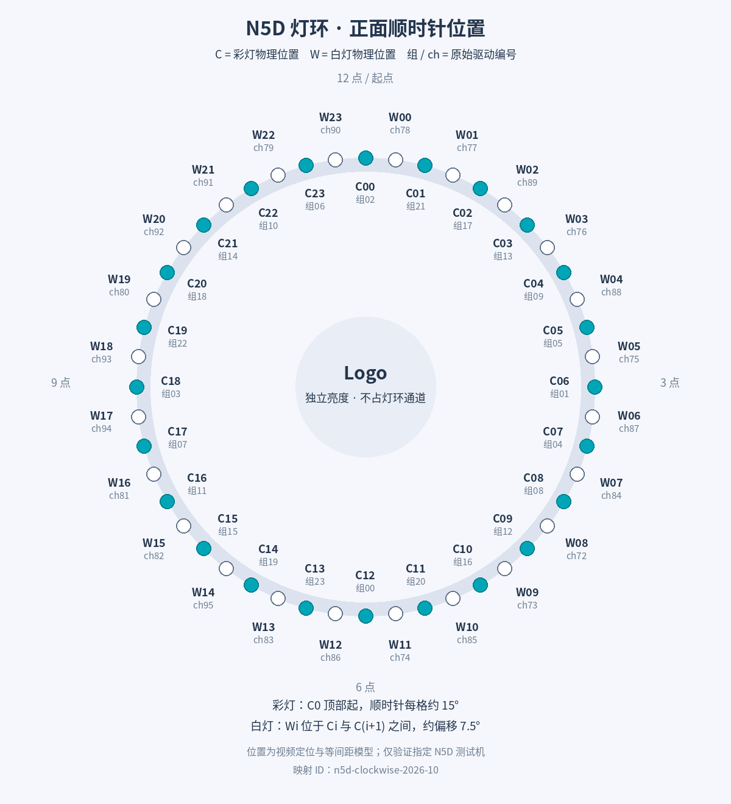

# N5D 灯光顺序与位置说明

对应灯环工坊 1.1／1.2、映射 ID `n5d-clockwise-2026-10`。依据测试机逐组点亮视频定位，并与当前 `Patterns.java` 和接口转换代码核对。

## 观察方向

面对设备正面，让 NFC 字样和中间标志保持正立。灯环顶部 12 点方向作为起点，沿顺时针递增。从设备背面观察会左右镜像，不能直接套用此图。



[下载矢量位置图](light-layout.svg)

图中 **C00～C23** 是彩灯的物理位置索引，**W00～W23** 是白灯的物理位置索引；`组` 和 `ch` 是原始驱动编号，不是额外的灯珠。图中的角度按等间距模型标注，用于定位与编程，不是机械测量结果。顶部基准和白灯偏移来自视频定位，受拍摄视角与扩散罩影响。

## 三种编号不要混用

| 编号 | 范围 | 用途 |
| --- | --- | --- |
| 彩灯物理位置 C | 0～23 | 从顶部顺时针排列，接口 rgb 数组使用此顺序 |
| 彩灯驱动组 g | 0～23 | 每组控制同一颗彩灯的 B、G、R，组号并非沿圆周递增 |
| 原始通道 ch | 0～95 | 0～71 为彩灯，72～95 为独立白灯 |
| 白灯物理位置 W | 0～23 | 从顶部后约 7.5° 开始顺时针排列，接口 white 数组使用此顺序 |

彩灯一组占 3 个原始通道：**蓝 = 3g，绿 = 3g+1，红 = 3g+2**。因此原始通道顺序为 **BGR**，不能直接按 RGB 写入。

白灯是独立光源，不是把彩灯三通道同时打开的“合成白”。彩灯和白灯在环上交错，白灯 Wi 位于彩灯 Ci 与 C(i+1) 之间，W23 位于 C23 与 C0 之间。彩灯角度模型为 `15° × i`，白灯为 `15° × i + 7.5°`。

## 完整顺时针位置表

| 彩灯位置 C | 彩灯角度 | 驱动组 g | 蓝 ch | 绿 ch | 红 ch | 白灯位置 W | 白灯角度 | 白灯 ch |
| --- | --- | --- | --- | --- | --- | --- | --- | --- |
| 0 | 0° | 2 | 6 | 7 | 8 | 0 | 7.5° | 78 |
| 1 | 15° | 21 | 63 | 64 | 65 | 1 | 22.5° | 77 |
| 2 | 30° | 17 | 51 | 52 | 53 | 2 | 37.5° | 89 |
| 3 | 45° | 13 | 39 | 40 | 41 | 3 | 52.5° | 76 |
| 4 | 60° | 9 | 27 | 28 | 29 | 4 | 67.5° | 88 |
| 5 | 75° | 5 | 15 | 16 | 17 | 5 | 82.5° | 75 |
| 6 | 90° | 1 | 3 | 4 | 5 | 6 | 97.5° | 87 |
| 7 | 105° | 4 | 12 | 13 | 14 | 7 | 112.5° | 84 |
| 8 | 120° | 8 | 24 | 25 | 26 | 8 | 127.5° | 72 |
| 9 | 135° | 12 | 36 | 37 | 38 | 9 | 142.5° | 73 |
| 10 | 150° | 16 | 48 | 49 | 50 | 10 | 157.5° | 85 |
| 11 | 165° | 20 | 60 | 61 | 62 | 11 | 172.5° | 74 |
| 12 | 180° | 0 | 0 | 1 | 2 | 12 | 187.5° | 86 |
| 13 | 195° | 23 | 69 | 70 | 71 | 13 | 202.5° | 83 |
| 14 | 210° | 19 | 57 | 58 | 59 | 14 | 217.5° | 95 |
| 15 | 225° | 15 | 45 | 46 | 47 | 15 | 232.5° | 82 |
| 16 | 240° | 11 | 33 | 34 | 35 | 16 | 247.5° | 81 |
| 17 | 255° | 7 | 21 | 22 | 23 | 17 | 262.5° | 94 |
| 18 | 270° | 3 | 9 | 10 | 11 | 18 | 277.5° | 93 |
| 19 | 285° | 22 | 66 | 67 | 68 | 19 | 292.5° | 80 |
| 20 | 300° | 18 | 54 | 55 | 56 | 20 | 307.5° | 92 |
| 21 | 315° | 14 | 42 | 43 | 44 | 21 | 322.5° | 91 |
| 22 | 330° | 10 | 30 | 31 | 32 | 22 | 337.5° | 79 |
| 23 | 345° | 6 | 18 | 19 | 20 | 23 | 352.5° | 90 |

表内同一行的白灯位于对应彩灯之后约半个位置，不代表 RGB 与白灯处于同一封装或同一角度。

## 四个方位快速核对

| 方位 | 彩灯位置 | 彩灯组 | 蓝／绿／红原始通道 | 顺时针紧邻的白灯 |
| --- | --- | --- | --- | --- |
| 上方 12 点 | C0 | 2 | 6／7／8 | W0，ch78 |
| 右方 3 点 | C6 | 1 | 3／4／5 | W6，ch87 |
| 下方 6 点 | C12 | 0 | 0／1／2 | W12，ch86 |
| 左方 9 点 | C18 | 3 | 9／10／11 | W18，ch93 |

白灯不恰好落在这四条轴线上；表中列的是各方向彩灯之后的白灯。

## 原始组号反查物理位置

| 驱动组 g | 彩灯位置 C | 驱动组 g | 彩灯位置 C |
| --- | --- | --- | --- |
| 0 | 12 | 12 | 9 |
| 1 | 6 | 13 | 3 |
| 2 | 0 | 14 | 21 |
| 3 | 18 | 15 | 15 |
| 4 | 7 | 16 | 10 |
| 5 | 5 | 17 | 2 |
| 6 | 23 | 18 | 20 |
| 7 | 17 | 19 | 14 |
| 8 | 8 | 20 | 11 |
| 9 | 4 | 21 | 1 |
| 10 | 22 | 22 | 19 |
| 11 | 16 | 23 | 13 |

## 接口如何使用

### 推荐：rgb_white

`rgb` 是 72 字节，按物理位置从 C0 到 C23 排列，每个位置内部使用 **RGB** 顺序。服务负责把它转换为原始 BGR 和驱动组映射。

```text
rgb[3*i]     = 红
rgb[3*i + 1] = 绿
rgb[3*i + 2] = 蓝
white[i]     = 白灯 Wi
```

例如只点顶部红灯与其顺时针紧邻的白灯：`rgb[0]=255`、`white[0]=128`，其他字节置 0；`brightness` 和 `white_brightness` 再独立设置整体亮度。不要把驱动组号当成 rgb 数组的物理位置。

### 高级：raw96

`channels` 是 96 字节，按原始通道编号直接传入。相同例子是 `channels[8]=255`、`channels[78]=128`，其余置 0。

```text
g = RGB_POSITION_TO_GROUP[i]
channels[3*g]     = 蓝
channels[3*g + 1] = 绿
channels[3*g + 2] = 红
channels[WHITE_POSITION_TO_CHANNEL[i]] = 白
```

顺时针映射常量：

```text
RGB_POSITION_TO_GROUP = [
  2,21,17,13,9,5,1,4,8,12,16,20,
  0,23,19,15,11,7,3,22,18,14,10,6
]
WHITE_POSITION_TO_CHANNEL = [
  78,77,89,76,88,75,87,84,72,73,85,74,
  86,83,95,82,81,94,93,80,92,91,79,90
]
```

## 中间 Logo

中间 Logo 是独立的亮度控制，**不属于灯环 0～95 通道**，也不占用彩灯或白灯数组。通过接口 LOGO 命令，或 FRAME 的可选 `logo` 字段控制，数值范围 0～255；它没有可选 RGB 颜色。

## 定位与使用边界

- 这些映射在改装 N5D / LineageOS Android 11 / Magisk Root 测试机上验证，不保证其他型号、批次或驱动相同。
- 数字通道不按圆周排序是接线映射造成的表现，不能因此判断灯珠故障。跑马灯应沿物理位置 C/W 递增，再映射到原始通道。
- 扩散罩会把相邻灯光混合，照片中的亮区边界不等于灯珠边界，白灯混入也会改变观感。
- 接口完整帧未点亮的位置应显式置 0；颜色通道范围为 0～255，底层 DIM 仍受芯片量化影响。数据值不是实测光度。
- 临时使用可申请控制会话，用完 RELEASE；默认恢复灯环工坊接管前的灯效、Logo 和开关状态。

详细绑定、消息与会话流程见 [本机控制接口](control-api.md)，驱动与屏幕适配见 [硬件说明](hardware.md)。
